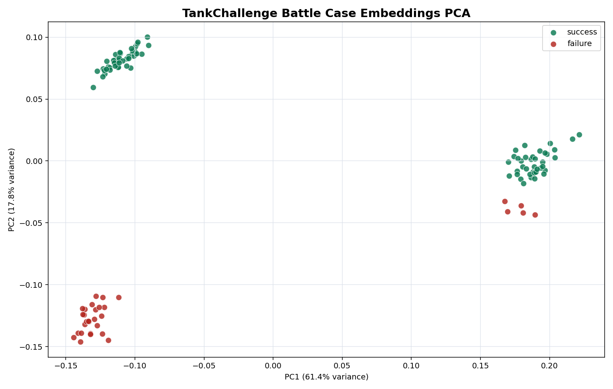

# TankChallenge RAG Decision Support Report

## Purpose

TankChallenge shot logs are converted into natural-language battle case documents.
The system embeds those cases, retrieves similar historical success/failure shots,
and recommends whether to fire or correct aim first.

## Dataset

- Indexed cases: 114
- Success cases: 83
- Failure cases: 31
- Search backend: faiss
- Top-k: 5

## Offline Evaluation

- Conservative fire/hold decision agreement: 45.6%
- Average impact error: 2.50m
- Similar-success error floor: 1.69m

> Note: decision agreement is a strict fire/hold threshold metric, not raw retrieval precision.
> Retrieval quality is inspected in the backend comparison table below.

## Retrieval Quality Comparison

| Query | Backend | Success/Failure | Success Rate | Avg Impact Error | Avg Success Distance |
|---|---:|---:|---:|---:|---:|
| Moving target mid-range aim | faiss | 5/0 | 100% | 2.42m | 102.0m |
| Moving target mid-range aim | chroma | 5/0 | 100% | 2.42m | 102.0m |
| Moving target mid-range aim | hybrid | 1/4 | 20% | 3.61m | 117.1m |
| Moving target mid-range aim | overlap | FAISS-Hybrid: 0, FAISS-Chroma: 5 | | | | |
| Stationary far target | faiss | 5/0 | 100% | 0.93m | 108.0m |
| Stationary far target | chroma | 5/0 | 100% | 0.93m | 108.0m |
| Stationary far target | hybrid | 5/0 | 100% | 1.00m | 108.0m |
| Stationary far target | overlap | FAISS-Hybrid: 1, FAISS-Chroma: 5 | | | | |

## Recommendation Examples

### Moving target mid-range aim

```json
{
  "query": {
    "target_type": "moving_enemy",
    "distance": 85.0,
    "body_error": 3.0,
    "turret_error": 0.8,
    "pitch_error": -0.1,
    "enemy_speed": 0.4,
    "lead_distance": 0.0
  },
  "recommendation": {
    "fire": true,
    "confidence": 1.0,
    "summary": "Similar-case success rate is 100% (threshold 64%, moving/mid). Recommendation: fire.",
    "yaw_correction_deg": -0.777,
    "pitch_correction_deg": 0.208,
    "decision_threshold": 0.64,
    "distance_bucket": "mid",
    "target_mode": "moving",
    "reason_codes": [
      "SAME_BUCKET_SUCCESS_WEIGHTED"
    ]
  },
  "quality": {
    "top_k": 5,
    "success_count": 5,
    "failure_count": 0,
    "success_rate": 1.0,
    "avg_impact_error": 2.422118810928467,
    "avg_success_distance": 102.01,
    "avg_failure_distance": null
  },
  "top_matches": [
    {
      "case_id": "moving_shot_log_7.csv:14",
      "score": 1.071,
      "hit_label": "success",
      "distance": 104.92,
      "impact_error": 3.306135404615817
    },
    {
      "case_id": "moving_shot_log_2.csv:3",
      "score": 1.067,
      "hit_label": "success",
      "distance": 77.0,
      "impact_error": 1.056422058899255
    },
    {
      "case_id": "moving_shot_log_7.csv:9",
      "score": 1.064,
      "hit_label": "success",
      "distance": 103.68,
      "impact_error": 4.05089763876276
    }
  ]
}
```

### Stationary far target

```json
{
  "query": {
    "target_type": "stationary",
    "distance": 120.0,
    "body_error": 2.0,
    "turret_error": 0.2,
    "pitch_error": 0.05,
    "enemy_speed": 0.0,
    "lead_distance": 0.0
  },
  "recommendation": {
    "fire": true,
    "confidence": 1.0,
    "summary": "Similar-case success rate is 100% (threshold 62%, stationary/far). Recommendation: fire.",
    "yaw_correction_deg": 0.117,
    "pitch_correction_deg": 0.06,
    "decision_threshold": 0.62,
    "distance_bucket": "far",
    "target_mode": "stationary",
    "reason_codes": [
      "SAME_BUCKET_SUCCESS_WEIGHTED"
    ]
  },
  "quality": {
    "top_k": 5,
    "success_count": 5,
    "failure_count": 0,
    "success_rate": 1.0,
    "avg_impact_error": 0.9288247556512149,
    "avg_success_distance": 108.002,
    "avg_failure_distance": null
  },
  "top_matches": [
    {
      "case_id": "shot_log_4.csv:4",
      "score": 1.037,
      "hit_label": "success",
      "distance": 108.0,
      "impact_error": 0.8414073554579725
    },
    {
      "case_id": "shot_log_1.csv:1",
      "score": 1.037,
      "hit_label": "success",
      "distance": 120.0,
      "impact_error": 0.7629510231851578
    },
    {
      "case_id": "shot_log_3.csv:4",
      "score": 1.034,
      "hit_label": "success",
      "distance": 108.0,
      "impact_error": 0.8722965667397152
    }
  ]
}
```

## PCA Visualization

The embedding space is reduced from 384 dimensions to 2 dimensions using PCA.



PCA data file: `pca_embedding_points.csv`

## Enhanced Recommendation Logic

- Weighted average is computed from similar success cases.
- Failure cases adjust the correction away from repeated miss patterns.
- Distance buckets are separated into close, mid, and far.
- Moving and stationary targets use separate confidence thresholds.
- Fire/hold confidence threshold is tuned by distance, target mode, and current aim risk.

## Example Case Documents

- `shot_log_1.csv:1`: [Situation] stationary target, distance 120.0m, body yaw error -0.00deg, turret yaw error -0.00deg, pitch error 0.15deg. Enemy speed 0.00m/s, lead distance 0.00m. [Action] Fired at target. [Result] success; hit field 'Rock002_120m_Front', impact error 0.76m, range error 0.74m.
- `shot_log_1.csv:2`: [Situation] stationary target, distance 100.0m, body yaw error 13.02deg, turret yaw error -0.42deg, pitch error -0.04deg. Enemy speed 0.00m/s, lead distance 0.00m. [Action] Fired at target. [Result] success; hit field 'Rock002_100m_Right', impact error 1.54m, range error 1.30m.
- `shot_log_1.csv:3`: [Situation] stationary target, distance 80.0m, body yaw error 13.57deg, turret yaw error -0.42deg, pitch error -0.15deg. Enemy speed 0.00m/s, lead distance 0.00m. [Action] Fired at target. [Result] success; hit field 'Rock002_80m_Rear', impact error 1.19m, range error 0.97m.

## How To Run

```powershell
python rag_decision_support\tank_rag.py build
python rag_decision_support\tank_rag.py build-embeddings
python rag_decision_support\tank_rag.py build-chroma
python rag_decision_support\pca_visualize.py
python rag_decision_support\tank_rag.py query --backend faiss --distance 85 --body-error 3 --turret-error 0.8 --pitch-error -0.1 --enemy-speed 0.4
python rag_decision_support\tank_rag.py report --backend faiss
```
